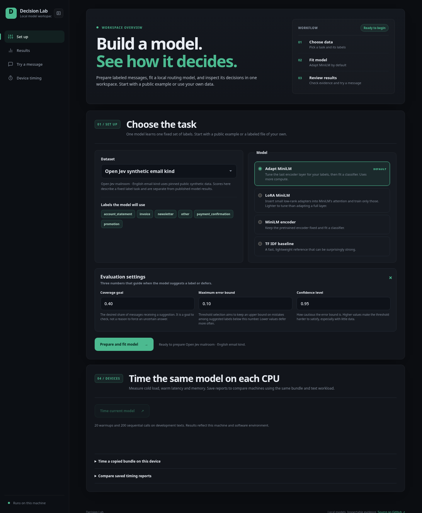

# Decision Runtime

Apache-2.0 Python SDK for offline, fixed-label text decisions. It loads complete
versioned bundles, verifies hashes and optional Ed25519 signatures, applies the
exported preprocessing, calibration and abstention policy, and runs locally
without a platform connection. It also includes local evaluation, inspection,
benchmark and shadow-mode tools. The optional local lab offers dataset import,
sparse or MiniLM candidate fitting, evaluation and device timing in a browser.

## Run with Docker Compose

From the [public repository](https://github.com/cutamar/decision-runtime):

```bash
git clone https://github.com/cutamar/decision-runtime.git
cd decision-runtime
docker compose up --build -d
```

Open **http://127.0.0.1:8765**. The default image includes sparse, frozen
MiniLM, adapted MiniLM and LoRA MiniLM choices. Its first build installs the CPU training
dependencies; the pinned MiniLM files and public benchmark data download on
first use. The app and model execution stay local. Compose publishes the port
only on the host's loopback address and stores uploads, cached data and model
bundles in the persistent `lab_data` volume. `docker compose down` stops the
app and keeps that volume. To inspect run files, use
`docker compose exec lab ls /data/web-runs`; to copy a bundle to the host, use
`docker compose cp lab:/data/web-runs/RUN_ID/bundle ./bundle` with the run ID
shown in the app.

Use `docker compose logs -f lab` to inspect startup or job errors, and
`docker compose down` to stop the service. The default image is large because
it includes CPU PyTorch for adaptation. For a smaller image without adaptation, build with
`ENABLE_ADAPT=0 docker compose up --build -d`; select the fixed MiniLM encoder
or TF IDF baseline in that image. The adapted and LoRA model choices require
rebuilding with `ENABLE_ADAPT=1`.

If you are in the platform repository, run
`docker compose -f runtime/compose.yaml up --build -d` instead. The Docker Compose
plugin is required (`docker compose version`). On Linux with Docker Engine but no
Compose command, install the Compose plugin using
[Docker's instructions](https://docs.docker.com/compose/install/linux/).

## Run directly with Python

This directory is an independently buildable package. From this runtime directory
(or its separate Git repository):

```bash
python -m pip install -e .
# Add the neural extra to load MiniLM ONNX bundles:
python -m pip install -e '.[neural]'
```

From the platform repository root, use `python -m pip install -e './runtime[neural]'`.

## Local model lab



Install the lab extra and start the app from a local checkout:

```bash
python3 -m venv .venv
.venv/bin/python -m pip install 'torch==2.14.0+cpu' --index-url https://download.pytorch.org/whl/cpu
.venv/bin/python -m pip install -e '.[lab,adapt]'
.venv/bin/decision-web
```

Open `http://127.0.0.1:8765`. The default dataset is a pinned public
synthetic email task and the default model adapts the last MiniLM layer. You can
switch to support routing or upload your own UTF-8 CSV/JSONL file with `text`
and `label` fields (30 or more accepted rows, 2–20 labels). `group_id` is
recommended for related messages. The app discovers labels, validates the
file, makes a group-aware split, fits the chosen model, and evaluates that
**same exported model** on its holdout. You can inspect metrics, per-label
results, calibration, the review policy and raw reports, then write your own
message to see its predicted label, probabilities and whether the policy would
suggest it or defer it for review. Your trial text is not saved as training
material. Model choices are a sparse TF-IDF baseline, the frozen MiniLM
encoder, last-layer-adapted MiniLM, and LoRA-adapted MiniLM (small low-rank
adapters on attention query/value, merged back into the exported encoder). The
default adapted model and the LoRA option need CPU PyTorch. On a CPU-only machine,
install a compatible CPU PyTorch wheel before the `adapt` extra. For a lighter
install, use `.[lab]` and select the fixed MiniLM encoder or TF IDF baseline
in the app. MiniLM source files are downloaded at a pinned revision and
verified by hash.

The public presets are narrow **fixed-label projections** of the
[Open-Jev dataset](https://huggingface.co/datasets/ZefanCai/Open-Jev): English
email kind (six labels) and English support routing (four labels). First use
downloads and verifies synthetic files from Hugging Face. A separate shifted
set can be checked after fitting each preset. These diagnostics are **not
Open-Jev or JevBench scores** and do not establish customer accuracy. See
[BENCHMARKS.md](BENCHMARKS.md) for exact mapping, counts, rights, results and
comparison limits.

The evaluation settings control the review policy: **coverage goal** is the
desired share of messages receiving a label, **maximum error bound** limits
the upper confidence bound on error among accepted suggestions, and
**confidence level** controls how conservative that bound is. The app displays
the observed holdout coverage and accepted error separately from those goals.
If every row defers, accepted error is shown as unavailable. Results describe
one split and should be checked on authorized, representative data before use.

The **Device timing** section measures cold model load, 200 sequential CPU
predictions after 20 warmups, p50/p95 latency, throughput and peak process RSS.
For another machine, copy the *same* bundle and the run's
`benchmark-texts.json`, start this app there, and use **Time a copied bundle**.
Download both JSON reports and select them in **Compare timing reports**. The
app compares reports only when bundle manifest hash, workload hash and sample
count match. Measurements depend on the machine, software environment and
workload. They do not claim phone, GPU or hosted-device performance.

Direct Python runs bind only to `127.0.0.1` by default and save uploads,
candidate bundles and reports in `data/web-runs/` under the current directory.
The Compose setup listens inside its container and publishes only to host
loopback. Run the app on
a trusted machine with permitted data; it has one local operator, no account
isolation and no hosted upload service. Training and evaluation are exploratory and do not issue a qualified production release.

For a signed bundle, obtain its trusted public key separately from the bundle:

```python
from decision_runtime import DecisionModel

model = DecisionModel.load("router-v1", trusted_public_key=open("trusted-public.pem", "rb").read())
result = model.predict("Please help with my invoice")
print(result.to_dict())
```

For an unsigned bundle created locally, pass `allow_unsigned=True` explicitly.
Only a qualified release can return an actionable `accepted` choice. Evaluation
mode returns `would_accept` or `would_defer` without an actionable choice.

```bash
decision-inspect router-v1 --trusted-public-key trusted-public.pem
decision-evaluate router-v1 labeled.csv --trusted-public-key trusted-public.pem --output evaluation.json
decision-benchmark router-v1 --texts representative-texts.json --output benchmark.json
```

`labeled.csv` needs `text,label` columns. JSONL accepts objects with the same
fields. The evaluator uses the local inference kernel and reports label accuracy,
macro F1, coverage, accepted error, calibration and a confusion matrix. It does
not claim independent sampling or production qualification. The format contract
is in [BUNDLE_FORMAT.md](BUNDLE_FORMAT.md). A runnable sparse-bundle example is
in [examples](examples).

The package contains no telemetry or model weights. Customer bundles and data
remain under their own permissions and notices.

Run the standalone contract tests with `python -m unittest discover -s tests`
from this directory. A wheel can be built with
`python -m pip wheel --no-deps . -w dist`.
