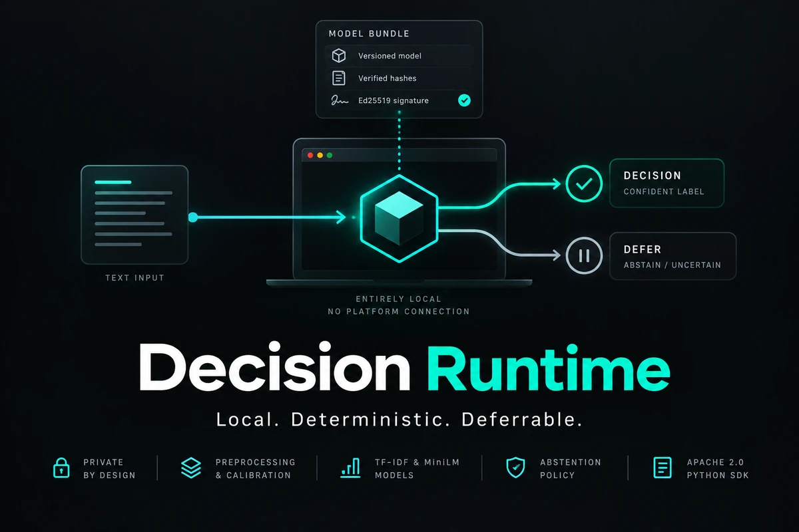

<div align="center">



# Decision Runtime

**An Apache-2.0 Python SDK for offline, fixed-label text decisions — plus a local lab to build the models.**

[](https://github.com/cutamar/decision-runtime/actions/workflows/tests.yml)


</div>

Load a complete versioned bundle, verify its hashes and optional Ed25519
signature, apply the exported preprocessing, calibration and abstention policy,
and get a decision — all **locally, with no platform connection**. The package
also ships evaluation, inspection, benchmark and shadow-mode tools, and an
optional **browser lab** for building candidates from your own labeled data.

---

## 📑 Contents

- [✨ What it does](#-what-it-does)
- [🚀 Quick start](#-quick-start)
- [🧪 The local model lab](#-the-local-model-lab)
- [🧠 Using the SDK](#-using-the-sdk)
- [🔒 Privacy & safety](#-privacy--safety)
- [🛠️ Develop](#️-develop)

---

## ✨ What it does

- 📦 **Runs bundles, not guesswork.** Everything that affects a decision —
  tokenizer, encoder/graph, labels, calibration, thresholds, policy — travels in
  one signed, versioned bundle.
- 🎯 **Knows when to defer.** Calibrated probabilities and an explicit `abstain`
  result mean an uncertain input is deferred, never forced.
- 🏠 **Local by default.** No network, no telemetry, no bundled weights; the SDK
  never phones home or takes a business action for you.
- 🧪 **Build in the browser.** The lab imports data, fits a sparse or MiniLM
  candidate, evaluates the exported model, and times it — all on your machine.

---

## 🚀 Quick start

### 🐳 Docker Compose (simplest)

```bash
git clone https://github.com/cutamar/decision-runtime.git
cd decision-runtime
docker compose up --build -d
```

Open **http://127.0.0.1:8765**. The default image includes the **sparse, frozen
MiniLM, adapted MiniLM and LoRA MiniLM** choices. First build installs CPU
training dependencies; the pinned MiniLM files and public benchmark data
download on first use. Everything runs locally, and Compose publishes the port
only on host loopback.

> 💡 **Lighter image:** the default is large because it bundles CPU PyTorch. Build
> without adaptation via `ENABLE_ADAPT=0 docker compose up --build -d` and use
> the frozen encoder or TF-IDF baseline; the adapted and LoRA choices need
> `ENABLE_ADAPT=1`.

<details>
<summary>🔧 Compose operations (logs, run files, copying a bundle)</summary>

```bash
docker compose logs -f lab                                   # startup / job errors
docker compose exec lab ls /data/web-runs                    # list run files
docker compose cp lab:/data/web-runs/RUN_ID/bundle ./bundle  # copy a bundle out
docker compose down                                          # stop, keep the lab_data volume
```

The Compose plugin is required (`docker compose version`). On Linux with Docker
Engine but no Compose command, install it via
[Docker's instructions](https://docs.docker.com/compose/install/linux/). From
the platform repository, use `docker compose -f runtime/compose.yaml up --build -d`.

</details>

### 🐍 Python package

```bash
python -m pip install -e .
python -m pip install -e '.[neural]'   # to load MiniLM ONNX bundles
```

From the platform repository root, use `python -m pip install -e './runtime[neural]'`.

---

## 🧪 The local model lab


Install the lab extra and launch the app from a local checkout:

```bash
python3 -m venv .venv
.venv/bin/python -m pip install 'torch==2.14.0+cpu' --index-url https://download.pytorch.org/whl/cpu
.venv/bin/python -m pip install -e '.[lab,adapt]'
.venv/bin/decision-web
```

Open **http://127.0.0.1:8765**. Pick a public preset or upload your own
UTF-8 CSV/JSONL with `text` and `label` fields (**30+ accepted rows, 2–20
labels**; add `group_id` to keep related messages together). The app discovers
labels, validates the file, makes a **group-aware split**, fits the chosen
model, and evaluates **that same exported model** on a held-out slice. Inspect
metrics, per-label results, calibration and the review policy — then type a
message to see its predicted label, probabilities, and whether the policy would
suggest or defer it. Your trial text is never saved as training material.

### 🤖 Model choices

| Choice | What it is | Needs PyTorch? |
|---|---|---|
| **TF-IDF baseline** | Sparse linear classifier — small and fast | No — `.[lab]` is enough |
| **Frozen MiniLM** | Pinned encoder + fitted linear head | No |
| **Adapted MiniLM** | Last transformer layer fine-tuned, re-exported to ONNX | Yes — `.[lab,adapt]` |
| **LoRA MiniLM** | Low-rank adapters on attention Q/V, merged back into the encoder | Yes — `.[lab,adapt]` |

> On a CPU-only machine, install a compatible CPU PyTorch wheel **before** the
> `adapt` extra. For a lighter install, use `.[lab]` and pick the frozen encoder
> or TF-IDF baseline. MiniLM source files download at a pinned revision and are
> verified by hash.

### 🎛️ Evaluation settings

These three numbers shape the accept/defer policy — the app always reports the
**observed** holdout coverage and accepted error separately from these goals.

| Setting | Meaning |
|---|---|
| **Coverage goal** | Desired share of messages that receive a label |
| **Maximum error bound** | Upper confidence bound on error among accepted suggestions |
| **Confidence level** | How conservative that bound is |

If every row defers, accepted error is shown as *unavailable*. Results describe
one split; check them on authorized, representative data before relying on them.

### 📚 Public presets

Narrow **fixed-label projections** of the
[Open-Jev dataset](https://huggingface.co/datasets/ZefanCai/Open-Jev): English
email kind (six labels) and English support routing (four labels). First use
downloads and verifies the synthetic files from Hugging Face, and a separate
**shifted set** can be checked after fitting. These diagnostics are **not
Open-Jev or JevBench scores** — see [BENCHMARKS.md](BENCHMARKS.md) for mapping,
counts, rights, and comparison limits.

### ⏱️ Device timing

Measures cold model load, 200 sequential CPU predictions after 20 warmups,
p50/p95 latency, throughput and peak RSS. To compare machines: copy the *same*
bundle and the run's `benchmark-texts.json`, run the app there, and use **Time a
copied bundle**; then load both JSON reports into **Compare timing reports**
(matched only when bundle hash, workload hash and sample count agree).
Measurements are machine- and workload-specific and make no phone/GPU/hosted
claim.

---

## 🧠 Using the SDK

Load a **signed** bundle with its trusted public key obtained separately from
the bundle:

```python
from decision_runtime import DecisionModel

model = DecisionModel.load("router-v1", trusted_public_key=open("trusted-public.pem", "rb").read())
result = model.predict("Please help with my invoice")
print(result.to_dict())
```

For a locally built **unsigned** bundle, pass `allow_unsigned=True` explicitly.
Only a *qualified* release returns an actionable `accepted` choice; evaluation
mode returns `would_accept` / `would_defer` without acting.

### 🧰 Command-line tools

| Command | Purpose |
|---|---|
| `decision-inspect` | Show the bundle manifest, versions and qualification status |
| `decision-evaluate` | Score labeled CSV/JSONL: accuracy, macro F1, coverage, accepted error, calibration, confusion matrix |
| `decision-benchmark` | Cold load, warm latency, throughput and peak RSS |
| `decision-shadow` | Batch predictions by ID, without copying text or acting |
| `decision-web` | Launch the local model lab |

```bash
decision-inspect router-v1 --trusted-public-key trusted-public.pem
decision-evaluate router-v1 labeled.csv --trusted-public-key trusted-public.pem --output evaluation.json
decision-benchmark router-v1 --texts representative-texts.json --output benchmark.json
```

`labeled.csv` needs `text,label` columns (JSONL accepts objects with the same
fields). The evaluator uses the local inference kernel and does **not** claim
independent sampling or production qualification. The format contract is in
[BUNDLE_FORMAT.md](BUNDLE_FORMAT.md), and a runnable sparse-bundle example lives
in [examples](examples).

---

## 🔒 Privacy & safety

- 🚫 **No telemetry, no bundled weights.** Customer bundles and data stay under
  their own permissions and notices.
- 🏠 **Loopback only.** Direct Python runs bind to `127.0.0.1` and save uploads,
  candidate bundles and reports in `data/web-runs/`; Compose publishes only to
  host loopback.
- 👤 **Single operator.** No account isolation and no hosted upload service — run
  on a trusted machine with permitted data.
- 🧪 **Exploratory by design.** Lab training and evaluation do **not** issue a
  qualified production release.

---

## 🛠️ Develop

```bash
python -m unittest discover -s tests   # standalone contract tests
python -m pip wheel --no-deps . -w dist  # build a wheel
```
